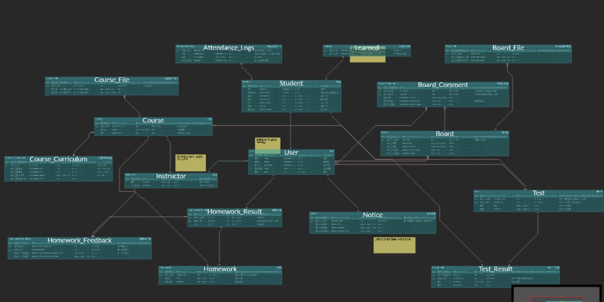

# be12-1st-404Error-EduLink

 
 

<h3>404Error</h3>
<h4>2팀 - 👽김무성, 🐹김유진, 🐨김정엽, 🦊오건하, 🤖이우진</h4>

## 🤼‍♂️팀원 소개 

  <table  align="center">
    <tbody>
      <tr>
        <td align="center"><a href="https://github.com/706com" style="text-decoration: none; color: lightgray;"> <b> 👽 김무성</b></a> </td>
        <td align="center"><a href="https://github.com/postrel63" style="text-decoration: none; color: lightgray;"> <b> 🐹 김유진</b></a> </td>
        <td align="center"><a href="https://github.com/shinebyul" style="text-decoration: none; color: lightgray;"> <b> 🐨 김정엽</b></a> </td>
        <td align="center"><a href="https://github.com/choijw1116" style="text-decoration: none; color: lightgray;"> <b> 🦊 오건하</b></a> </td>
            <td align="center"><a href="https://github.com/wergx" style="text-decoration: none; color: lightgray;"> <b> 🤖 이우진</b></a> </td>
      </tr>
    </tbody>
  </table>

 

 
<!--

	<h2>📚 Tech Stack 📚</h2>
	
✨ Platforms & Languages ✨

	 
	
        
	 
	

 

	<h2>🛠 Tools 🛠</h2>

	
	

 
 
-->

# 📌EduLink LMS 서비스 기획서

## 1. 서비스 소개

빠르게 증가하는 국비지원 부트캠프 수요에 비해 교육 품질을 지원하는 환경은 여전히 부족한 실정입니다.  
 
특히, 현재 사용 중인 LMS(HRD-Net)는 출결 확인 외의 기능이 거의 없어, 수강생들은 휴가 사용 현황, 커리큘럼 진행 상황, 공지, 학습 성과 확인 등을 별도의 방식으로 처리해야 하는 불편함을 겪고 있습니다.  

이에 저희는 학습 효율을 높일 수 있는 서비스인 “EduLink”를 제안합니다.  

EduLink는 앞서 설명한 문제들을 해결하기 위해 개발된 새로운 LMS 플랫폼입니다. 단순한 출결 확인을 넘어, 체계적인 강의 정보 제공, 커리큘럼 관리, 공지사항 통합, 학습 성과 분석 등 수강생의 학습 효율을 극대화할 수 있는 기능을 제공합니다.

## 2. 서비스 배경

최근 몇 년간 국비지원 부트캠프와 첨단산업 인재 양성을 위한 교육 프로그램이 급증하고 있습니다. 2023년에는 10개 대학이 161개 기업과 협력하여 1,255명의 인재를 양성했으며, 2024년에는 이차전지, 차세대 디스플레이, 바이오, 항공·우주산업 등 새로운 분야로 확대될 예정입니다. 이러한 교육 프로그램은 단기 집중 교육을 통해 첨단산업 분야로 진출할 수 있는 실질적 인재를 양성하고 있습니다.

그러나 현재 국비지원교육에서 사용되고 있는 **HRD-Net**은 출결 확인 외의 기능이 전무해, 수강생들이 커리큘럼 진행 상황, 공지사항, 학습 성과 등 필수 정보를 확인하려면 별도의 방식에 의존해야 하는 불편함이 존재합니다. 교육 품질의 향상을 위한 학습 관리 시스템(LMS)의 필요성이 절실한 상황입니다.

동시에, **LMS 시장**은 급속히 성장하고 있습니다. 팬데믹을 계기로 온라인 학습 환경에 대한 수요가 폭발적으로 증가했으며, LMS는 단순히 교육기관뿐만 아니라 기업, 공공기관, 학회 등 다양한 분야에서 도입되고 있습니다. 실제로 LMS 시장은 연평균 31.4%씩 성장해 2025년에는 332억 달러 규모에 이를 것으로 전망됩니다. LMS는 학습자의 학습 활동을 지원하고 관리하며, 비대면 학습뿐 아니라 대면 학습과 병행할 때도 큰 효과를 발휘하는 시스템으로 자리 잡았습니다.

이러한 배경에서, 우리는 기존의 불편함을 해소하고 부트캠프 교육의 효율성을 극대화할 수 있는 새로운 LMS 플랫폼인 EduLink를 기획하게 되었습니다. **EduLink**는 부트캠프 수강생에게 단순 출결 관리뿐만 아니라 커리큘럼 정보, 학습 성과, 공지사항 등의 기능을 통합적으로 제공하여 학습 경험을 혁신적으로 개선하고자 합니다.

## 3. 서비스 목표

현대의 개발자 부트캠프는 강의 중심의 교육에서 벗어나 학생들 간의 협력과 소통, 강사와의 피드백을 중심으로 한 학습 환경이 요구됩니다. 하지만 기존 플랫폼은 학생 간의 네트워킹과 강사와의 실시간 커뮤니케이션, 학습 데이터 관리에 한계가 있습니다. 

이러한 문제를 해결하기 위해 커뮤니티와 학원/강사 관리 통합 시스템을 기획했습니다.

**“EduLink” 서비스의 필요성** 
1) 현재 HRD-Net은 출석 체크에만 국한된 기능을 제공하며, 학습자의 진도, 과제 제출, 시험 관리 등 학습 전반에 필요한 기능을 지원하지 못하고 있다.
2) 강사와 학습자 간의 실시간 소통이나 협업 도구를 제공하지 않아, 학습 중 발생하는 질문이나 문제를 즉각적으로 해결하기 어렵다.

3) 교육 과정 중 발생하는 학생들의 학습 진도나 과제 제출 상황을 실시간으로 확인하기 어려워, 적절한 피드백과 지원을 제공하지 못하는 경우가 많다.

**“EduLink” 서비스를 통한 해결방안**
1) 출석 관리 외에도 과제 제출, 시험 관리, 학습 진도 추적 등의 기능을 제공하여 강사와 학습자가 학습 전반을 효과적으로 관리할 수 있도록 지원한다.

2) 학습자와 강사가 실시간 채팅, 알림, 공지를 통해 소통할 수 있도록 한다.

3) 학습자가 자신의 학습 진도, 평가 결과 등을 확인할 수 있는 자료를 제공한다.

# 📚기능/요구사항/테스트 명세서

 <h3>1. 기능 명세서</h3> 

 <h3>2. 요구사항 정의서</h3> 

<a href="">요구사항 정의서<a/>  

 

# 🐸ERD

[ERD](https://www.erdcloud.com/d/JN9kEWsGQtke5x2KW)
 

 

# 🐳시스템 아키텍처

 

# 💻SQL개발
<!--

	
 <b>DDL </b> 

	 
	 
	 
	 
	 
	 
	 

 <b>1. USER회원가입 </b> 

	
- nickname,email,password,signup_date,user_auth의 값을 입력하고 회원가입을 한다. 

  
 

 <b>2. USER정보조회 </b> 

	
- USER정보(전체조회)
  - select all로 USER테이블에서 전체유저정보를 조회한다.

     
    

- USER정보(특정유저정보조회)
  - select all로 USER테이블에서 where절에서 해당 조건으로 특정유저정보를 조회한다.
     
    

 <b>3. CHAT-ROOM생성 </b> 

	
- idx=5인 post에서 idx=1인 user가 채팅하기를 클릭했을 때 
1. 생성 조건 확인 
 
2. 이미 참여중인 채팅방이 있는지 확인 
 
3. 게시글 작성자 확인 
 
4. chat_room 생성 
 

	
 <b>4.CHAT_ROOM리스트 조회 </b>

- 참여중인 채팅방 조회(user idx=1) 
  
- 내가 작성자인 게시글의 채팅방 조회(user idx=1) 
  
- 내가 신청자인 게시글의 채팅방 조회(user idx=1) 
  

 <b>5. CHAT_MESSAGE생성 </b> 

	
- chattime, message, send_user_idx, CHAT_ROOM_idx를 insert해서 CHAT_MESSAGE를 생성한다.
  
   
  

 <b>6. POST작성 </b> 

	
- title, c_top_give,c_top_want,c_btm_give,c_bottom_want,contents, post_time, modify_time,status, post_type,USER_idx 를 입력하고 POST작성을 한다.

 

 <b>7. 글 상세 조회 </b> 

	
- title, c_top_give,c_top_want,c_btm_give,c_bottom_want,contents, post_time, modify_time,status, post_type,USER_idx를 POST테이블에서 where절에서 해당조건으로 조회한다.
 

	

 <b>8. 글 목록 조회 </b> 

- 전체 글 목록 조회 
  
- 나눔 글 목록 조회 
  
- 교환 글 목록 조회. 
  

 <b>9. USER가 작성한 글 조회 </b> 

	
- title, c_top_give,c_top_want,c_btm_give,c_bottom_want,contents, post_time, modify_time,status, post_type,USER_idx를 POST테이블에서 where절에서 해당조건으로 USER가 작성한 글을 조회한다.

   
  

 <b>10. USER가 신청한 글 조회 </b> 

	
- POST_MATCHING_USER 테이블을 참조하여 해당 테이블 안에 있는 해당 USER_IDX를 찾고, 해당 USER의 POST_ID를 찾아 해당 POST의 ID에 맞는 글을 조회한다.

   
  

	
 <b>11. 검색 </b> 

	

		- 카테고리 검색(idx=1 인 카테고리 선택) 
		  
		- 키워드 검색(키워드 : "software") 
		  
		  
	

	
 <b>12. 교환상대확정 </b> 

	

	- 게시글 상태 변경 후 교환 상대 저장 
  	
	

 
 

-->

# 💻SQL 성능개선
<!--

 <b> 전체POST에서 교환글(OR 나눔글)조회 성능개선 </b> 

 
 
 
1. 일반쿼리문 실행시 5227행 , 0.015sec 

 
 

Before

 

 
 

 
 

2. 인덱스쿼리 실행시 2336행 , 0.000 sec

 

After

 
 

-->
